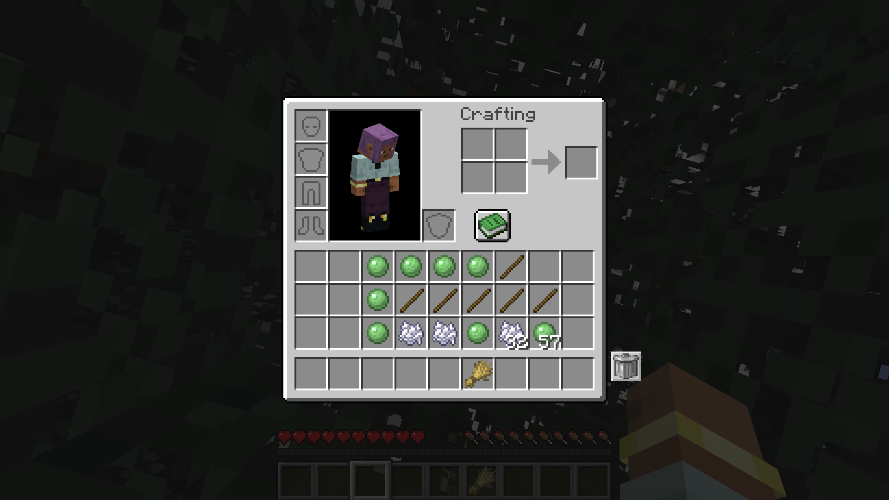
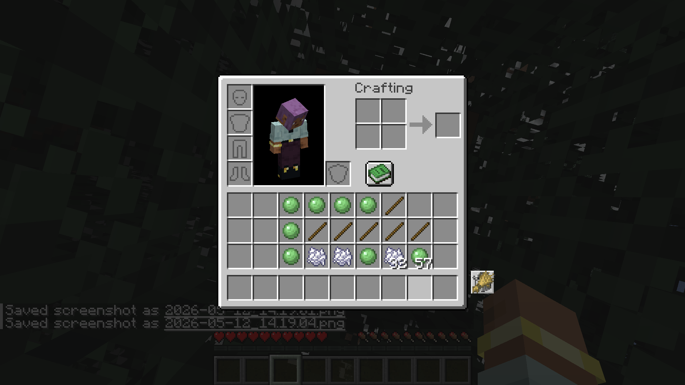
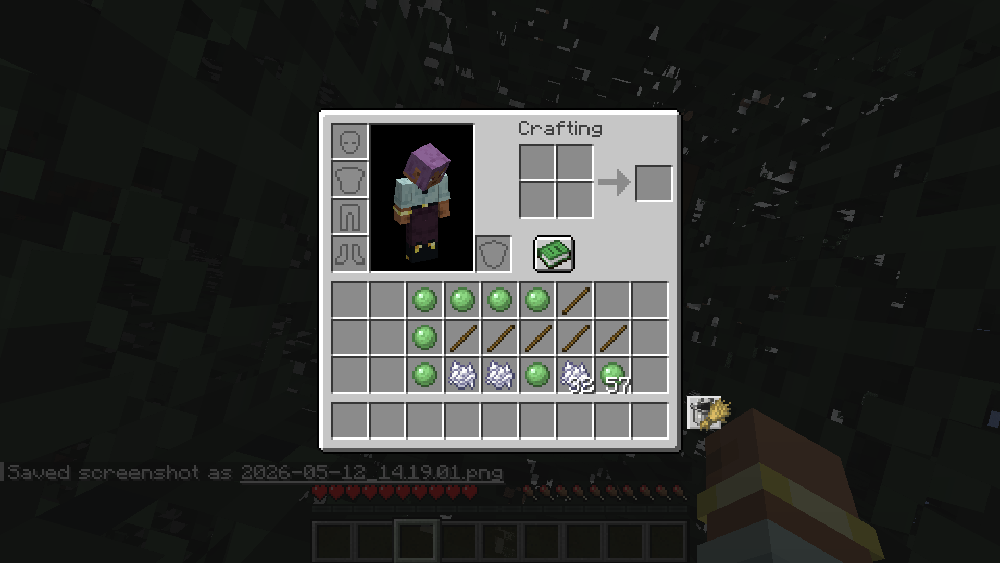
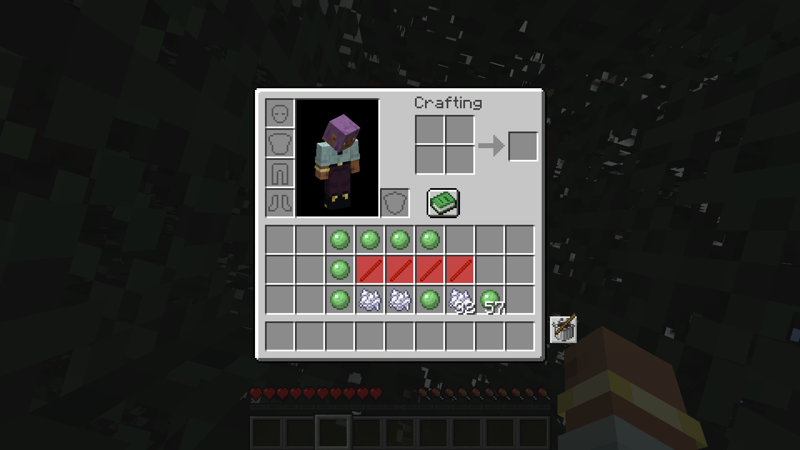

# Inventory Trash Can

A Minecraft Fabric mod that adds a trash can button to the inventory screen for quick and practical disposal of unwanted items.

## Features

- **Trash Button** — A trash can icon in the inventory screen. Click to trash the item you're holding.
- **Undo** — The last trashed item stays in the trash slot. Click the empty slot to restore it.
- **Bulk Delete** — Hold **Shift** and click the trash button (or press **Shift+Delete**) to delete all matching items from your inventory at once.
- **Bulk Undo** — Restoring a bulk-deleted item returns the full stack.
- **Count Display** — When bulk trashing, the trash slot shows how many items were deleted.
- **Shift+Hover Highlight** — Hold **Shift** and hover over the trash button to highlight all matching items in your inventory with a red overlay.
- **Delete Key** — Press **Delete** to quickly trash the item you're holding (or restore the last trashed item if your hand is empty).
- **Configurable Position** — Adjust the trash button position via `config/inventory_trash_can.json`.

## Usage

| Action | Result |
|--------|--------|
| Click trash button (holding item) | Trashes held item |
| Click trash button (empty hand) | Restores last trashed item |
| Shift + Click trash button | Deletes all matching items from inventory |
| Shift + Hover trash button | Highlights matching items in red |
| Delete key (holding item) | Trashes held item |
| Delete key (empty hand) | Restores last trashed item |
| Shift + Delete | Deletes all matching items from inventory |

## Configuration

`config/inventory_trash_can.json`:

```json
{
  "slotX": 0,
  "slotY": 0
}
```

- `slotX` — Horizontal offset for the trash button (default: 0)
- `slotY` — Vertical offset for the trash button (default: 0)

## Requirements

- **Minecraft:** 26.1.x
- **Fabric Loader:** >=0.18.5
- **Fabric API:** >=0.145.4
- **Java:** 25

## Installation

1. Install Fabric Loader for Minecraft 26.1.
2. Download the latest `.jar` from [Releases](https://github.com/Cukkoo12/inventory-trash-can/releases).
3. Place the `.jar` in your `mods` folder.
4. Launch the game.

## License

## Screenshots






## License

MIT
